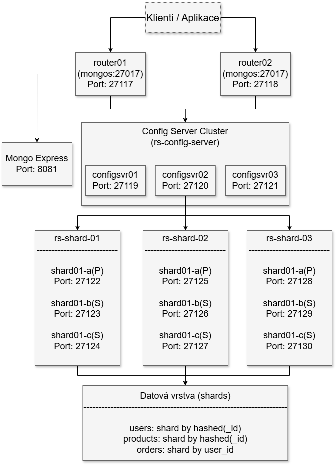

# 1. část semestrální práce - NoSQL databáze - MongoDB

## Architektura

Architektura řešení vychází z https://github.com/minhhungit/mongodb-cluster-docker-compose/tree/master/.

### Schéma a popis architektury

Stručný popis k obrázku/schématu, do schématu uveďte názvy kontejnerů, IP adres, porty a další podrobnosti, nejedná se o obecné schéma, ale konrkétní schéma Vašeho řešení, využijte např. draw.io nebo jakýkoliv jiný podobný nástroj.

- popis viz níže

### Specifika konfigurace

- **2x Mongos (routery)**: 
  - `router01` a `router02` – slouží jako vstupní body pro dotazy.

- **3x Config Servery**: 
  - `configsvr01`, `configsvr02`, `configsvr03` – replikační sada (`rs-config-server`) pro ukládání metadat clusteru.

- **3x Shardy**, každý s 3 replikami:
  - `rs-shard-01`:
    - `shard01-a`, `shard01-b`, `shard01-c`
  - `rs-shard-02`:
    - `shard02-a`, `shard02-b`, `shard02-c`
  - `rs-shard-03`:
    - `shard03-a`, `shard03-b`, `shard03-c`

- **Mongo Express**: 
  - Webové UI pro správu, připojené k `router01`.

- **Autentizace**: 
  - Použítí `--keyFile` pro zabezpečení mezi uzly.

- **Perzistence dat**: 
  - Všechny uzly mají Docker volumes pro `/data/db` a `/data/configdb`.

- **Síť**: 
  - Implicitní Docker síť (`bridge`), porty mapované na hostitele:
    - `27117–27130` pro MongoDB
    - `8081` pro Mongo Express

#### Cluster (minimálne 1)

Kolik clusterů pro Vaše řešení využíváte a proč?

1 cluster. Více clusterů by se dalo například využít při práci s více různými databázemi (v ukźce pouze databáze eshop). Navíc i s jediným clusterem byl ukázán sharding a replikace.

#### Uzly (minimálně 3)

Kolik uzlů pro Vaše řešení využíváte a proč?

Kolik uzlů: 14 uzlů (2 mongos + 3 config servery + 9 shard uzlů).
Proč:
Mongos (2): Pro load balancing a dostupnost vstupní vrstvy.
Config servery (3): Pro konzistenci a vysokou dostupnost metadat clusteru.
Shardy (9): Pro horizontální škálování (3 shardy) a redundanci (3 uzly na shard).

#### Sharding (minimálně 3)

Kolik shardů pro Vaše řešení používáte a proč jej považujete za dostačující vzhledem k použitým datům?

Kolik shardů: 3 shardy (rs-shard-01, rs-shard-02, rs-shard-03).
Vzhledem k objemu dat si myslím, že 3 shardy jsou dostatečné. Kolekce users a products jsou rovnoměrně rozloženy (hashed) skrze svoje _id a orders jsou rozloženy podle user_id. Předpoklad je, že vyhledávání orders bude nejčastěji pres user_id.

#### Replikace (minimálně 3)

Kolik replikací pro Vaše řešení používáte a proč je považujete za dostačující vzhledem k použitým datům?

Kolik replikací: 4 replikační sady (rs-config-server, rs-shard-01, rs-shard-02, rs-shard-03), každá s 3 replikami.
- 1 sada pro config servery je nutná pro sharded cluster.
- 3 sady pro shardy kombinují sharding a replikaci.
- 3 repliky na sadu zajišťují redundanci a dostupnost.
Pro testovací data chrání před ztrátou a ukazují princip replikace.

#### Perzistence dat (minimálně 3)

Jakým způsobem řeší Vaše databáze perzistenci dat? (Uveďte práci s primární a sekundární pamětí, způsob načtení a ukládání dat.)

1) Pomocí Docker volumes (/data/db, /data/configdb) pro všechny uzly
Když kontejner restartuje nebo se smaže, data uložená ve volumes zůstávají na disku hostitele, takže cluster může obnovit předchozí stav. Například pokud shard-01-node-a zapíše data do /data/db, volume mongodb_cluster_shard01_a_db je uchová i po docker-compose down.

2) RAM (primární paměť)
MongoDB používá WiredTiger, který drží aktivní data v cache v RAM. Například pokud klient přes router01 čte data z rs-shard-01, primární uzel (shard-01-node-a) načte indexy a pracovní sadu do RAM pro rychlý přístup.

3) Disk (sekundární paměť)
WiredTiger periodicky (každých 60 sekund) flushuje data z RAM na disk do souborů v /data/db. Současně zapisuje změny do journalu (/data/db/journal/), což umožňuje obnovu po pádu (např. při výpadku Docker kontejneru).

#### Distribuce dat

V mém řešení je distribuce dat v MongoDB sharded clusteru implementována následujícím způsobem:

1. **Rozdělení dat pomocí shardingu:**
   - Databáze používá 3 shardy (rs-shard-01, rs-shard-02, rs-shard-03), každý s vlastní replikační sadou
   - Kolekce jsou shardovány podle různých strategií:
     - `users`: Hash sharding podle `_id` - zajišťuje rovnoměrné rozložení uživatelských profilů napříč všemi shardy
     - `products`: Hash sharding podle `_id` - podobně jako u uživatelů zajišťuje rovnoměrnou distribuci produktů
     - `orders`: Range sharding podle `user_id` - zajišťuje, že všechny objednávky stejného uživatele jsou uloženy na stejném shardu, což optimalizuje dotazy při hledání objednávek konkrétního uživatele

2. **Replikace dat:**
   - Každý shard má 3 repliky (shard01-a, shard01-b, shard01-c), které fungují jako replikační sada
   - Při startu clusteru se v každé replikační sadě zvolí primární uzel (dle nastavené priority)
   - Při výpadku primárního uzlu automaticky proběhne nová volba primárního uzlu z dostupných sekundárních replik

3. **Proces distribuce dat při zápisu:**
   - Klient se připojí k jednomu z routerů (router01 nebo router02)
   - Router komunikuje s config servery pro určení, na který shard má být záznam uložen
   - Na základě shardovacího klíče router směruje požadavek na příslušný shard
   - Primární uzel shardu přijme zápis a replikuje jej na sekundární uzly v rámci replikační sady

4. **Proces distribuce dat při čtení:**
   - Čtení jsou standardně směrována na primární uzel každé replikační sady
   - Sekundární uzly mohou být využity pro čtení při nastavení read preference (např. secondaryPreferred)

#### Zabezpečení

Jakým způsobem jste zabezpečili databázi a proč? (Minimálně autentizace a autorizace.) Pozor u MongoDB nesmí chybět keyfile.

Keyfile: --keyFile /data/mongodb-keyfile zajišťuje interní autentizaci mezi uzly.

openssl rand -base64 756 > <path-to-keyfile>
chmod 400 <path-to-keyfile>

Autentizace klientů: Uživatelé admin:big2025 (pro správu), user_manager:userpass2025, product_manager:productpass2025, order_processor:orderpass2025 (pro eshop) omezují přístup.
Autorizace: Role root pro admin (plný přístup), readWrite pro ostatní uživatele na specifické kolekce (users, products, orders) v eshop.

## Případ užití

Pro jaký účel jste si danou databázi zvolili a proč? Proč jste nezvolili jinou databázi vzhledem k účelu použití?

Zvolil jsem si MongoDB pro demonstraci sharding, replikace a zabezpečení v semestrální práci, simulující e-shop s kolekcemi. Dokumentový model je flexibilní a zvládá tak ukládat vnořená data (např. preferences, items). Samotné nastavení shardingu a replikace mi přišlo intuitivní a přehledné. Redis fungující na principu key-value nebyl idelaní pro vnořené struktury. Co se týče Cassandry, tak její filozofie vypadá zajímavě, nicméně plnhodnotné nastavení databáze se zdálo složité a méně intuitivní.

## Výhody a nevýhody

Jaké výhody a nevýhody má Vaše řešení (využití datatabéze) a proč?

viz předchozí otázka

## CAP teorém

Jaké garance zvolené nasazení (konfigurace) NoSQL databáze splňuje a odůvodnění, proč právě tyto garance jsou pro Vaše řešení dostačující?

Databáze upřednostňuje konzistenci (C) a odolnost vůči rozdělení (P) před plnou dostupností (A). Během síťového rozdělení, kdy není k dispozici většina uzlů, MongoDB odmítne zápisy, aby zajistil, že data zůstanou konzistentní.

## Dataset

* Popište datové soubory (mohou být i vygenerované).
* Minimálně 3 různé datové soubory.
* Popište způsob nahrání do databáze.
* Popis dat (počet) a formátu a případných úprav vně i vni. Jsou tato pro Vaše řešení dostačující? Pokud ne, proč jste nevyužili i další datové formáty?
* Jak databáze nakládá s daty?
* Zdroje dat / způsob generování dat.

- Datové soubory: 3 kolekce – users (uživatelé), products (produkty), orders (objednávky), dohromady kolekce eshopu
- Nahrání: docker cp pro kopii souborů do router01, mongoimport pro import do eshop databáze
- Popis: Defaultně stovky záznamů (nastavitelné), JSON formát
- Nakládání: MongoDB ukládá v BSON, distribuuje shardingem, replikuje
- Zdroje: Generováno skriptem [generator.py](data/generator.py) s Faker knihovnou pro realistická data.

## Závěr

V rámci první části semestrální práce jsem implementoval plně funkční shardovaný cluster MongoDB s replikací, zabezpečením a distribuovanou architekturou. Řešení simuluje prostředí e-shopu s kolekcemi uživatelů, produktů a objednávek, které jsou strategicky rozděleny pomocí hash a range shardingu pro optimální distribuci dat a výkon dotazů.

### Hlavní přínosy řešení:

1. **Škálovatelnost a výkon**: Horizontální škálování pomocí 3 shardů umožňuje efektivní distribuci dat. Rozložení kolekce orders podle user_id optimalizuje nejčastější dotazy - vyhledávání objednávek konkrétního uživatele.

2. **Vysoká dostupnost**: Nasazení 3 replik na každý shard poskytuje dostatečnou redundanci pro případ výpadku.

3. **Zabezpečení**: Zabezpečení zahrnuje autentizaci mezi uzly pomocí keyfile, autentizaci klientů s různými uživatelskými účty a autorizaci založenou na rolích umožňující kontrolu přístupu k datům.

4. **Flexibilita datového modelu**: Dokumentový model MongoDB dobře odpovídá potřebám e-shopu, kde schéma dat může být proměnlivé a obsahuje vnořené struktury jako položky objednávek nebo uživatelské preference.

### Úskalí a omezení:

1. **Komplexnost správy**: Sharded cluster s 14 uzly představuje značnou správní zátěž oproti jednodušším řešením. V produkčním prostředí by bylo potřeba řešit monitoring, zálohování a strategie obnovy po havárii.

Vytvořené dotazy nad daty ukazují, že MongoDB s navrženou architekturou poskytuje flexibilní a výkonné prostředí pro různé typy operací, od jednoduchých vyhledávání a agregací až po složitější analýzy.

## Zdroje

Uveďte všechny zdroje použité pro první část semestrální práce např. dokumentace, videa, odborná literatura, github/gitlab, apod.
- https://courses.fit.cvut.cz/BI-BIG/@B232/prednasky/03/index.html
- https://github.com/minhhungit/mongodb-cluster-docker-compose/tree/master/
- https://www.mongodb.com/docs/manual/
