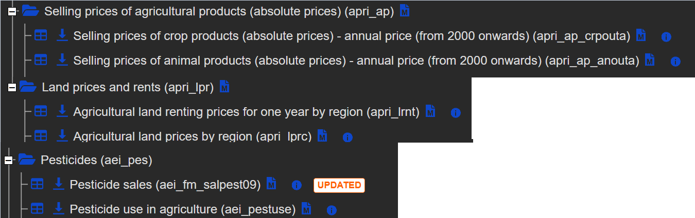

# 2. část semestrální práce - ELK Stack

## Analýza zemědělských dat v Evropě

Téma této práce se zaměřuje na analýzu zemědělských dat v Evropě, konkrétně na ceny zemědělské půdy, prodejní ceny zemědělských produktů a používání pesticidů. Cílem analýzy je identifikovat trendy, například jak se mění ceny půdy v závislosti na regionu a čase, jaké jsou rozdíly v používání pesticidů mezi zeměmi a jaké faktory ovlivňují ceny zemědělských produktů.

### Data

Vypište jednotlivé **kolekce dat** (nejméně 3) a všechny jejich
**datové soubory** (nejméně 6). Uveďte, jak spolu jednotlivé kolekce souvisí a jak tvoří jeden tématický celek, to samé uveďte u datových souborů.

Kolekce datových sad musí být vzájemně propojitelné přes nějaký společný identifikátor/sloupec, např. lokace, časový okamžik, administrativní jednotku, kategorii entit apod. Uveďte, jak je tomu u Vašich datových souborů.

Nezapomeňte, že alespoň dva datové soubory musí mít nejméně 5000 záznamů a také, že data splňují jeden tématický celek a liší se od dat z první části.

Data vyberte tak, aby bylo možné vytvářet **smysluplné vizualizace**, jinak nebudete mít dostatečné vizualizace a tyto budou hodnoceny méně body.

Tato kapitola představuje základní seznámení s daty a jejich prvotní hrubou analýzu, ze které dostatečně plyne cíl možných výstupů z kolekcí dat a jejich datových souborů.

#### Zdroje dat

Uveďte zdroje dat, odkud jsou jednotlivé kolekce a jejich datové soubory čerpány, a to formou odkazu.



[Eurostat – Database](https://ec.europa.eu/eurostat/web/main/data/database)

---

- **agricultural_land_renting_prices.csv**  
  [Eurostat – Agricultural land renting prices](https://ec.europa.eu/eurostat/databrowser/view/apri_lrnt__custom_16409123/default/table?lang=en)

- **agricultural_land_prices.csv**  
  [Eurostat – Agricultural land prices](https://ec.europa.eu/eurostat/databrowser/view/apri_lprc__custom_16296442/default/table?lang=en)

---

- **pesticide_sales.csv**  
  [Eurostat – Pesticide sales](https://ec.europa.eu/eurostat/databrowser/view/aei_fm_salpest09__custom_16288666/default/table?lang=en)

- **pesticide_use_in_agriculture.csv**  
  [Eurostat – Pesticide use in agriculture](https://ec.europa.eu/eurostat/databrowser/view/aei_pestuse__custom_16296535/default/table?lang=en)

---

- **selling_prices_of_crop_products.csv**  
  [Eurostat – Selling prices of crop products](https://ec.europa.eu/eurostat/databrowser/view/apri_ap_crpouta__custom_16290877/default/table?lang=en)

- **selling_prices_of_animal_products.csv**  
  [Eurostat – Selling prices of animal products](https://ec.europa.eu/eurostat/databrowser/view/apri_ap_anouta__custom_16288638/default/table?lang=en)

#### Formát dat

Jak rozumíte jednotlivým datovým souborům jednotlivých datových sad, například **jakého formátu dat je každý sloupec, co je obsahem každého sloupce a popište případná integritní omezení na sloupcích**.

Všechny datové soubory jsou ve formátu CSV.. Níže je uvedený formát a popis dat pro každý datový soubor:

##### Obecná struktura

Většina datových souborů má podobnou strukturu s následujícími sloupci:
- **freq**: Frekvence měření (Annual - roční)
- **unit**: Jednotka měření (např. Euro per hectare, Euro, kilograms)
- **geo**: Geografická oblast (země, region)
- **TIME_PERIOD**: Rok záznamu (2011-2020)
- **OBS_VALUE**: Numerická hodnota měření

##### Specifická struktura podle datových souborů


**agricultural_land_prices.csv** & **agricultural_land_renting_prices.csv**
- **freq**: Textový řetězec, vždy "Annual"
- **unit**: Textový řetězec, "Euro per hectare"
- **agriprod**: Textový řetězec, typ zemědělské plochy (např. "Arable land", "Permanent grassland")
- **geo**: Textový řetězec, geografický region
- **TIME_PERIOD**: Integer, rok (2011-2020)
- **OBS_VALUE**: Float, cena za hektar v eurech

**pesticide_sales.csv**
- **freq**: Textový řetězec, vždy "Annual"
- **unit**: Textový řetězec, "Kilogram"
- **pesticid**: Textový řetězec, typ pesticidu (např. "Fungicides and bactericides", "Herbicides, haulm destructors and moss killers")
- **geo**: Textový řetězec, země
- **TIME_PERIOD**: Integer, rok (2011-2020)
- **OBS_VALUE**: Float, množství prodaných pesticidů v kilogramech

**pesticide_use_in_agriculture.csv**
- **freq**: Textový řetězec, vždy "Annual"
- **crops**: Textový řetězec, typ plodiny (např. "Cereals for the production of grain")
- **pesticid**: Textový řetězec, typ pesticidu (např. "Fungicides and bactericides")
- **unit**: Textový řetězec, "Kilogram"
- **geo**: Textový řetězec, země
- **TIME_PERIOD**: Integer, rok (2011-2020)
- **OBS_VALUE**: Float, množství použitých pesticidů v kilogramech

**selling_prices_of_crop_products.csv**
- **freq**: Textový řetězec, vždy "Annual"
- **currency**: Textový řetězec, "Euro"
- **prod_veg**: Textový řetězec, typ rostlinného produktu (např. "Soft wheat - prices per 100 kg")
- **geo**: Textový řetězec, země
- **TIME_PERIOD**: Integer, rok (2011-2020)
- **OBS_VALUE**: Float, prodejní cena v eurech

**selling_prices_of_animal_products.csv**
- **freq**: Textový řetězec, vždy "Annual"
- **currency**: Textový řetězec, "Euro"
- **prod_ani**: Textový řetězec, typ živočišného produktu (např. "Young cattle - prices per 100 kg live weight")
- **geo**: Textový řetězec, země
- **TIME_PERIOD**: Integer, rok (2011-2020)
- **OBS_VALUE**: Float, prodejní cena v eurech

Společné vlastnosti všech datových souborů:
1. Všechny soubory obsahují časovou řadu dat od roku 2011 do roku 2020
2. Všechny soubory obsahují data pro různé evropské země nebo regiony

V datech jsou zachována některá integritní omezení:
1. **Časové omezení**: Data jsou konzistentně v rozmezí let 2011-2020
2. **Měnové omezení**: Všechny finanční hodnoty jsou uvedeny v eurech

#### Provedené úpravy dat

Uveďte, zda jste provedli úpravy původních dat, např. snížili jste rozsah původních dat, provedli jste vyčištění chybných položek nebo vyčištění prázdných položek, bylo nutné data sjednotit či provém různé agregace z důvodu různých úrovní granularity dat, apod.

Kvůli velkému množství dat a logickému propojení/sjednocení dílčích datových souborů byly některé hodnoty sloupců omezeny vrámci webového prostředí eurostatu (ještě před stažením):

- **agricultural_land_renting_prices.csv**  
- time: 2011-2020
- unit: Euro per hectare
- agriprod: Arable land, Permanent grassland
- geo: ponechány pouze regiony (odstranění zemí)
---
- **agricultural_land_prices.csv**  
- time: 2011-2020
- unit: Euro per hectare
- agriprod: Arable land, Permanent grassland
- geo: ponechány pouze regiony (odstranění zemí)
---
- **selling_prices_of_crop_products.csv**  
- time: 2011-2020
- currency: Euro
---
- **selling_prices_of_animal_products.csv**  
- time: 2011-2020
- currency: Euro
---
- **pesticide_sales.csv**  
- time: 2011-2020
- pesticid: Fungicides and bactericides, Herbicides, haulm    destructors, and moss killers, Insecticides and acaricides,     Molluscicides, Plant growth regulators, Other plant protection products
---
- **pesticide_use_in_agriculture.csv**
- time: 2011-2020
- pesticid: Fungicides and bactericides, Herbicides, haulm    destructors, and moss killers, Insecticides and acaricides, Molluscicides, Plant growth regulators, Other plant protection products
- unit: kilograms
---

**Pokud jste použili skripty na úpravu dat vložte je do adresáře data.**
- byl vytvořen filter.py v /data, který očišťuje soubory od null hodnot

### Konfigurace

V této sekci jsou popsány všechny konfigurační soubory a jejich funkce v rámci ELK Stack (Elasticsearch, Logstash, Kibana) nasazení.

#### Docker Compose

Soubor `docker-compose.yml` definuje a konfiguruje všechny kontejnery potřebné pro ELK Stack:

- **elasticsearch**: Kontejner pro Elasticsearch databázi
  - Image: docker.elastic.co/elasticsearch/elasticsearch-oss:7.10.2
  - Porty: 9200 (API), 9300 (komunikace mezi nody)
  - Volume: konfigurace, perzistentní data

- **logstash**: Kontejner pro zpracování a transformaci dat
  - Image: docker.elastic.co/logstash/logstash-oss:7.10.2
  - Porty: 5000 (vstup), 9600 (monitoring API)
  - Volumes: konfigurace, šablony, pipeline definice, vstupní data
  - Závislost: Elasticsearch (spouští se až po Elasticsearch)

- **kibana**: Kontejner pro vizualizaci a analýzu dat
  - Image: docker.elastic.co/kibana/kibana-oss:7.10.2
  - Port: 5601 (webové rozhraní)
  - Volumes: konfigurace, perzistentní data
  - Závislost: Elasticsearch

- **cerebro**: Kontejner pro administraci a monitoring Elasticsearch
  - Image: yannart/cerebro
  - Port: 9000 (webové rozhraní)
  - Závislost: Elasticsearch

Všechny kontejnery jsou propojeny v síti "elastic" a využívají lokálních Docker volumes pro perzistenci dat.

#### Elasticsearch konfigurace

Soubor `elasticsearch/config/elasticsearch.yml` obsahuje základní konfiguraci Elasticsearch:

- `cluster.name: "docker-cluster"` - název clusteru
- `network.host: 0.0.0.0` - povolení přístupu ze všech síťových rozhraní
- `discovery.zen.minimum_master_nodes: 1` - umožňuje funkci s jediným uzlem
- `discovery.type: single-node` - konfigurace pro jednouzlový cluster
- `path.repo: ["/usr/share/elasticsearch/data/snapshots"]` - cesta pro ukládání snapshotů

#### Kibana konfigurace

Soubor `kibana/config/kibana.yml` obsahuje základní konfiguraci Kibana:

- `server.name: kibana` - název serveru
- `server.host: "0"` - povolení přístupu ze všech síťových rozhraní
- `elasticsearch.hosts: ["http://elasticsearch:9200"]` - připojení k Elasticsearch

#### Logstash konfigurace

Soubor `logstash/config/logstash.yml` obsahuje základní konfiguraci Logstash:

- `http.host: "0.0.0.0"` - povolení přístupu ke API ze všech síťových rozhraní
- `path.config: /usr/share/logstash/pipeline` - cesta k pipeline konfiguracím

#### Logstash pipeline konfigurace

V adresáři `logstash/pipeline/` se nachází několik konfiguračních souborů pro zpracování různých datových souborů:

- `agricultural_land_prices.conf`
- `agricultural_land_renting_prices.conf`
- `pesticide_sales.conf`
- `pesticide_use_in_agriculture.conf`
- `selling_prices_of_animal_products.conf`
- `selling_prices_of_crop_products.conf`

Struktura těchto konfiguračních souborů je velmi podobná, liší se především názvy indexů a specifickými poli pro různé datové sady. Jako příklad zde uvedu konfiguraci pro `agricultural_land_prices.conf`:

```
input {
  file {
    path => "/usr/share/logstash/data/agricultural_land_prices.csv"
    start_position => "beginning"
    sincedb_path => "/dev/null"
    tags => ["agricultural_land_prices"]
  }
}

filter {
  if "agricultural_land_prices" in [tags] {
    csv {
      separator => ","
      skip_header => true
      columns => ["freq", "unit", "agriprod", "geo", "TIME_PERIOD", "OBS_VALUE"]
    }

    mutate {
      convert => {
        "OBS_VALUE" => "float"
        "TIME_PERIOD" => "integer"
      }
      
      # Add month and day to create a complete date string
      add_field => { "date_string" => "%{TIME_PERIOD}-01-01" }
    }

    # Parse the formatted date string
    date {
      match => [ "date_string", "yyyy-MM-dd" ]
      target => "@timestamp"
      tag_on_failure => ["date_parse_failure"]
      remove_field => ["date_string"]
    }
  }
}

output {
  if "agricultural_land_prices" in [tags] {
    elasticsearch {
      hosts => ["elasticsearch:9200"]
      index => "agricultural_land_prices"
      template => "/usr/share/logstash/template/agricultural_land_prices.json"
      template_name => "agricultural_land_prices"
      template_overwrite => true
    }
  }
}
```

Klíčové vlastnosti této konfigurace:

1. **Input sekce**:
   - Definuje cestu k CSV souboru (`/usr/share/logstash/data/agricultural_land_prices.csv`)
   - Nastavuje začátek čtení na začátek souboru (`start_position => "beginning"`)
   - Ignoruje předchozí pozici čtení (`sincedb_path => "/dev/null"`)
   - Označuje zpracovávané záznamy tagem pro pozdější filtrování

2. **Filter sekce**:
   - Používá podmínku pro aplikaci filtrů pouze na záznamy s odpovídajícím tagem
   - CSV filtr rozděluje řádky podle čárky a přiřazuje hodnoty k pojmenovaným sloupcům
   - Mutate filtr konvertuje textové hodnoty na odpovídající datové typy (float, integer)
   - Vytváří časové značky ve formátu YYYY-MM-DD z roku v datovém souboru
   - Zpracovaný datum se ukládá do pole `@timestamp`

3. **Output sekce**:
   - Směřuje data do Elasticsearch
   - Ukládá data do indexu se stejným názvem jako zdrojový soubor
   - Používá předdefinovanou šablonu pro správné mapování datových typů
   - Přepisuje existující šablonu v případě aktualizací

#### Logstash template soubory

V adresáři `logstash/template/` se nacházejí JSON soubory definující mapování pro každý Elasticsearch index. Jejich struktura je opět velice podobná:

- `agricultural_land_prices.json`
- `agricultural_land_renting_prices.json`
- `pesticide_sales.json`
- `pesticide_use_in_agriculture.json`
- `selling_prices_of_animal_products.json`
- `selling_prices_of_crop_products.json`

Například `agricultural_land_prices.json` vypadá takto:

```json
{
  "index_patterns": ["agricultural_land_prices"],
  "mappings": {
    "properties": {
      "@timestamp": {
        "type": "date"
      },
      "freq": {
        "type": "keyword"
      },
      "unit": {
        "type": "keyword"
      },
      "agriprod": {
        "type": "text",
        "fields": {
          "keyword": {
            "type": "keyword"
          }
        }
      },
      "geo": {
        "type": "keyword"
      },
      "TIME_PERIOD": {
        "type": "integer"
      },
      "OBS_VALUE": {
        "type": "float"
      }
    }
  }
}
```

Tyto šablony zajišťují:
- Správné definování datových typů pro indexovaná pole (keyword, text, integer, float, date)
- Konzistentní mapování polí napříč dokumenty v indexu

### Dotazy

Popište a vysvětlete **5 různých dotazů do indexu**, při nich využijte minimálně filtrování, třídění, wildcard hledání, libovolné pokročilé hledání a další různé pokročilé hledání.

#### Dotaz 1: Filtrování a třídění cen půdy

Tento dotaz hledá záznamy o cenách zemědělské půdy v indexu agricultural_land_prices, kde je cena vyšší než 20000 Euro za hektar. Výsledky jsou seřazeny sestupně podle ceny (OBS_VALUE).

```json
GET agricultural_land_prices/_search
{
  "query": {
    "bool": {
      "must": [
        {"range": {"OBS_VALUE": {"gt": 20000}}}
      ]
    }
  },
  "sort": [{"OBS_VALUE": "desc"}],
  "size": 20
}
```

Tento dotaz využívá:
- Filtrování pomocí `range` pro nalezení vysokých cen půdy (nad 20000 Euro/ha)
- Třídění výsledků sestupně podle ceny pomocí parametru `sort`
- Omezení počtu výsledků na 20 pomocí parametru `size`

#### Dotaz 2: Wildcard hledání pesticidů

Tento dotaz hledá záznamy v indexu pesticidů (pesticide_sales), které obsahují v názvu slovo "regulator" a bylo jich prodáno více než 100000 kg.

```json
GET pesticide_sales/_search
{
  "query": {
    "bool": {
      "must": [
        {
          "wildcard": {
            "pesticid.keyword": "*regulator*"
          }
        }
      ],
      "filter": [
        {"range": {"OBS_VALUE": {"gt": 100000}}}
      ]
    }
  },
  "sort": [
    {"OBS_VALUE": "asc"}
  ]
}
```

Tento dotaz využívá:
- Wildcard hledání pomocí operátorů `*` před a za hledaným řetězcem "regulator", což umožňuje najít všechny regulátory růstu rostlin (Plant growth regulators) v databázi
- Kombinaci s filtrováním hodnot nad 100 000 kg
- Řazení výsledků vzestupně podle hodnoty OBS_VALUE

#### Dotaz 3: Agregace průměrných cen podle časového období

Tento dotaz provádí agregaci dat o cenách zemědělských produktů a vypočítává průměrné ceny produktů za jednotlivé roky.

```json
GET selling_prices_of_crop_products/_search
{
  "size": 0,
  "aggs": {
    "group_by_year": {
      "terms": {
        "field": "TIME_PERIOD",
        "order": {"average_price": "desc"}
      },
      "aggs": {
        "average_price": {
          "avg": {
            "field": "OBS_VALUE"
          }
        }
      }
    }
  }
}
```

Tento dotaz využívá:
- Agregační funkce pro výpočet průměrů (`avg`)
- Dělení dat do skupin podle roku (`terms` agregace na poli `TIME_PERIOD`)
- Řazení výsledků podle průměrné ceny
- Nastavení `size: 0` pro zobrazení pouze agregovaných výsledků místo jednotlivých dokumentů

#### Dotaz 4: Fuzzy hledání a vícenásobné podmínky

Tento dotaz hledá v indexu selling_prices_of_animal_products mléčné produkty (s využitím fuzzy matchingu pro slovo "milky") z období po roce 2015. Zároveň upřednostňuje výsledky z Německa nebo Francie.

```json
GET selling_prices_of_animal_products/_search
{
  "query": {
    "bool": {
      "must": [
        {
          "fuzzy": {
            "product": {
              "value": "milky",
              "fuzziness": "AUTO"
            }
          }
        },
        {"range": {"TIME_PERIOD": {"gte": 2015}}}
      ],
      "should": [
        {"match": {"geo": "Germany"}},
        {"match": {"geo": "France"}}
      ]
    }
  }
}
```

Tento dotaz využívá:
- Boolean query s kombinací podmínek `must` a `should`
- **Fuzzy matching** s parametrem `fuzziness: "AUTO"`, což umožňuje najít podobné výrazy jako "milk", "milks" nebo "milky", i když obsahují překlepy nebo drobné rozdíly v zápisu
- Časové filtrování pomocí `range` query pro omezení výsledků pouze na záznamy od roku 2015
- Boosting relevance pomocí `should` klauzule - dokumenty z Německa nebo Francie budou mít vyšší skóre relevance, ale stále se zobrazí i výsledky z ostatních zemí

#### Dotaz 5: Vyhledávání s využitím query_string a filtrů

Tento dotaz hledá v indexu pesticide_use_in_agriculture záznamy fungicidů nebo herbicidů použitých v letech 2018-2020, kde množství přesahuje 1000 kilogramů. Výsledky jsou řazeny podle roku (sestupně) a následně podle množství (sestupně).

```json
GET pesticide_use_in_agriculture/_search
{
  "query": {
    "bool": {
      "must": [
        {
          "query_string": {
            "query": "(Fungicides OR Herbicides)",
            "fields": ["pesticid"]
          }
        }
      ],
      "filter": [
        {
          "range": {
            "TIME_PERIOD": {
              "gte": 2018,
              "lte": 2020
            }
          }
        },
        {
          "range": {
            "OBS_VALUE": {
              "gt": 100000
            }
          }
        }
      ]
    }
  },
  "highlight": {
    "fields": {
      "pesticid": {}
    }
  },
  "sort": [
    {
      "TIME_PERIOD": "desc"
    },
    {
      "OBS_VALUE": "desc"
    }
  ],
  "size": 50
}
```

Tento dotaz využívá:
- **Query string** syntax pro pokročilé vyhledávání s použitím booleovských operátorů (OR) - umožňuje vyhledat záznamy obsahující buď "Fungicides" nebo "Herbicides"
- Omezení vyhledávání na konkrétní pole pomocí parametru `fields`
- Vícenásobné filtrování pomocí `range` klauzulí pro:
  - Časové období (pouze roky 2018-2020)
  - Množství pesticidů (nad 100000 kilogramů)
- Zvýraznění nalezených výrazů v poli `pesticid` pomocí funkce `highlight`
- Dvouúrovňové řazení výsledků - primárně podle roku (od nejnovějších) a sekundárně podle množství (od největšího)
- Omezení počtu výsledků na 50 záznamů pomocí parametru `size`

### Vizualizace

Exportujte si veškeré vizualizace ve formátu `JSON` viz  https://logz.io/blog/kibana-tutorial-2/. Pro obhajobu budete muset tento soubor do Kibany importovat, abyste výsledky mohli skutečně předvést. Soubor/y uložte do složky `results`.

Podrobně vizualizace popište ve složce `results` do souboru `readme.md`. 

Postup tvorby jednotlivých vizualizací popište v adresáři results do souboru `HOWTO.md`.

**Zde jen uveďte seznam provedených vizualizací (název) a druh vizualizace (např. graf, heatmapa, mapa, apod.).**
- Average/median land prices - Vertical Bar
- Crop and animal products prices - Area
- Highest average land rent prices - Heat Map
- Land price and rent derivative - Line
- Largest pesticide users - Tag Cloud
- Min/Max land prices - Horizontal Bar
- Most sold pesticids - Pie
- Pesticide Sales and Use Difference - Timelion

## Závěr

Tato práce se zaměřila na analýzu zemědělských dat v Evropě, konkrétně na ceny půdy, prodejní ceny zemědělských produktů a využívání pesticidů. Nashromážděná data z Eurostatu z let 2011-2020 poskytla příležitost pro identifikaci trendů a vztahů mezi různými aspekty evropského zemědělství.

### Přínos řešení

1. **Integrace dat**: Podařilo se úspěšně integrovat 6 různých datových souborů do 3 logicky provázaných dvojic (ceny půdy a nájmy půdy, prodej a využití pesticidů, ceny rostlinných a živočišných produktů), což umožnilo analýzu napříč různými aspekty zemědělského sektoru.

2. **Dotazování**: Implementované dotazy demonstrují sílu Elasticsearch jako analytického nástroje. Od jednoduchého filtrování a třídění až po agregace a fuzzy vyhledávání, systém umožňuje flexibilní analýzu dat podle různých kritérií.

3. **Časoprostorová analýza**: Řešení umožňuje sledovat vývoj cen a dalších ukazatelů v čase i napříč geografickými regiony, což poskytuje pohled na dynamiku evropského zemědělského trhu.

4. **Odhalení klíčových vztahů**: Analýza odhalila zajímavé souvislosti mezi cenami půdy, nájmy a využíváním pesticidů.

### Úskalí řešení

1. **Neúplnost dat**: Některé datové sady obsahovaly neúplné údaje pro určité roky nebo regiony, což vyžadovalo dodatečné čištění.

2. **Různá granularita dat**: Různé datové soubory měly odlišnou úroveň detailu (některé poskytovaly data na úrovni zemí, jiné na úrovni regionů), což komplikovalo jejich přímé porovnání.

3. **Interpretační výzvy**: Některé závislosti mezi daty nejsou na první pohled zřejmé a vyžadují hlubší porozumění kontextu evropského zemědělství pro správnou interpretaci.

## Zdroje
Uveďte všechny zdroje použité pro druhou část semestrální práce např. dokumentace, videa, odborná literatura, github/gitlab, apod.
- https://courses.fit.cvut.cz/BI-BIG/tutorials/06/The%20Elastic%20Stack%20-%20samostudium/index.html
- https://discuss.elastic.co/
- https://ec.europa.eu/eurostat/web/main/data/database