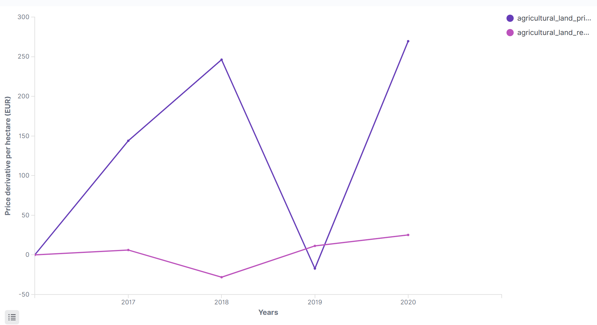
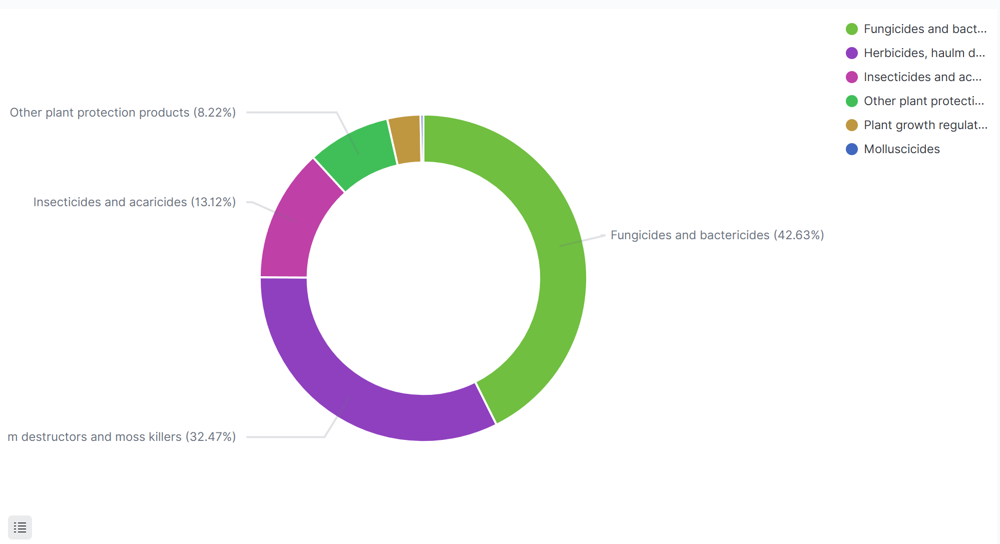

# Vizualizace dat - prezentace výsledků

## Vizualizace 1: Průměrné a mediánové ceny půdy

Tato vizualizace porovnává průměrné a mediánové ceny zemědělské půdy v Evropské unii v letech 2016-2020. Výrazný rozdíl mezi průměrem a mediánem naznačuje existenci extrémních hodnot v některých zemích, které ovlivňují průměr více než medián.

## Vizualizace 2: Ceny zemědělských plodin a živočišných produktů

Tento plošný graf zobrazuje vývoj cen zemědělských plodin a živočišných produktů v průběhu let 2016-2020. Lze pozoravat, že ceny živočišných produktů, jsou vždy násobně vyšší (EUR/100Kg).

## Vizualizace 3: Nejvyšší průměrné ceny nájmu půdy

Heatmapa zobrazuje deset regionů s nejvyššími průměrnými cenami nájmu zemědělské půdy v letech 2016-2020. Intenzita barvy reprezentuje výši nájemného v EUR za hektar. Tato vizualizace umožňuje identifikovat regiony s nejdražším pronájmem zemědělské půdy a sledovat vývoj těchto cen v čase.

## Vizualizace 4: Derivace cen půdy a nájmů

Tento spojnicový graf znázorňuje rychlost změny (derivaci) cen zemědělské půdy a nájmů v letech 2016-2020 průběhu času. Lze tak pozorovat dynamiku trhu s půdou v průběhu času.

## Vizualizace 5: Největší uživatelé pesticidů

Tag cloud vizualizuje deset zemí, které za obodbí 2016-2020 použili největší množství pesticidů v zemědělství. Velikost písma odpovídá množství použitých pesticidů - čím větší text, tím větší spotřeba. Tato vizualizace rychle identifikuje hlavní uživatele pesticidů.

## Vizualizace 6: Minimální a maximální ceny půdy

Horizontální sloupcový graf zobrazuje rozsah cen zemědělské půdy v letech 2016-2020, prezentující minimální a maximální ceny v EUR za hektar. Můžeme vidět, že rozdíl mizi minimem a maximem je markantní.

## Vizualizace 7: Nejprodávanější pesticidy

Koláčový graf zobrazuje rozložení prodeje různých typů pesticidů podle celkového množství prodaných kilogramů. Vizualizace pomáhá identifikovat, které skupiny pesticidů dominují trhu a představují největší podíl na celkovém objemu prodeje.

## Vizualizace 8: Rozdíl mezi prodejem a využitím pesticidů

Tato komplexní vizualizace vytvořená pomocí Timelion porovnává celkový prodej pesticidů s jejich skutečným využitím a zobrazuje rozdíl mezi těmito hodnotami. Graf umožňuje identifikovat potenciální nesrovnalosti mezi množstvím prodaných a skutečně použitých pesticidů, což může naznačovat skladování, nesprávné nakládání nebo nepřesnosti v reportování dat.